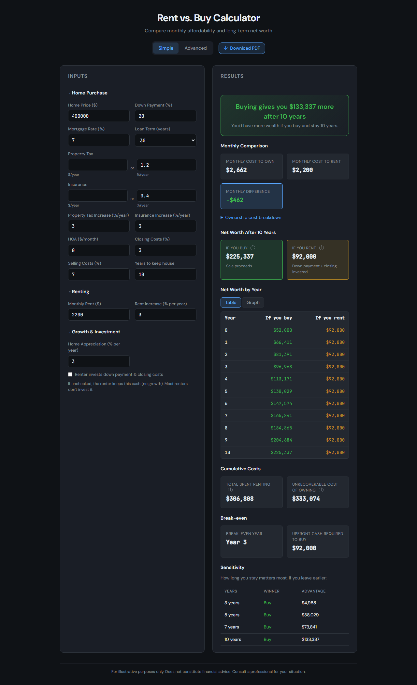

# Rent vs. Buy Calculator

A comprehensive rent vs. buy calculator that compares **monthly affordability** and **long-term net worth** under realistic assumptions.

## Screenshots

Simple mode — inputs, monthly comparison, net worth table, and sensitivity:

## Features

- **Simple mode** — MVP inputs: home price, down payment, mortgage, rent, growth rates, time horizon
- **Advanced mode** — Additional tax assumptions, moving costs, renters insurance
- **Monthly comparison** — Cost to own vs. rent, with ownership cost breakdown
- **Wealth comparison** — Net worth after X years for both paths (equity + investments)
- **Opportunity cost** — Models investment of down payment + closing costs when renting
- **Break-even analysis** — Year when buying overtakes renting
- **Sensitivity table** — Winner at 3, 5, 7, and 10 years
- **Reasonable defaults** — 20% down, 30-year loan, 3% appreciation, 6% investment return, 7-year horizon

## Usage

Open `index.html` in a browser. No build step required.

## Outputs

| Output | Description |
|--------|-------------|
| Monthly cost to own | P&I + property tax + insurance + maintenance + HOA |
| Monthly cost to rent | Starting rent (rent grows over time in calculations) |
| Net worth if you buy | Sale proceeds + invested monthly savings |
| Net worth if you rent | Down payment + closing costs + rent savings invested |
| Break-even year | First year when buyer net worth ≥ renter net worth |
| Upfront cash required | Down payment + closing costs |

## Model

- **Buyer**: Pays down payment + closing costs upfront. Each month pays P&I, taxes, insurance, maintenance, HOA. When rent > own cost, invests the difference at the investment return rate. At end of period, sells home (minus selling costs) and adds invested savings.
- **Renter**: Keeps down payment + closing costs invested from day one. Pays rent each month (growing at rent growth %). When own > rent, invests the savings. Net worth = investment account value at end.
- **Unrecoverable cost of owning**: Interest, property taxes, insurance, maintenance, HOA, closing costs, selling costs (no principal — that builds equity).

## License

For personal/educational use. Not financial advice.
